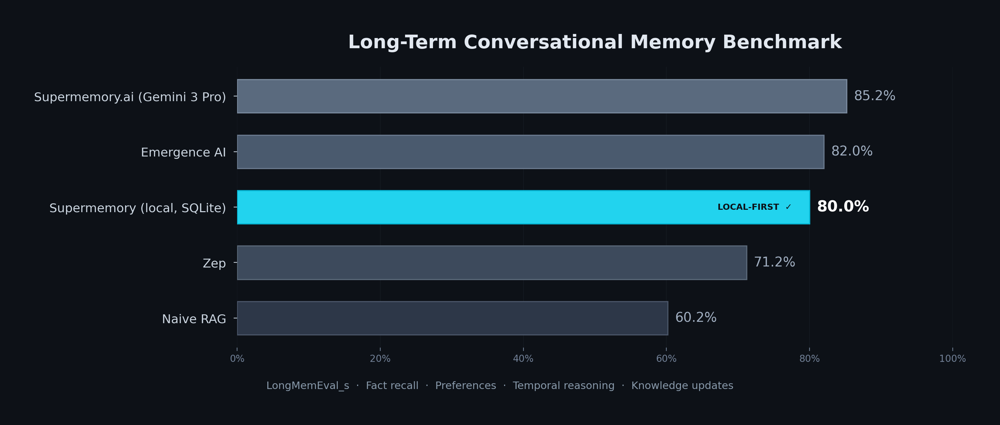

<p align="center">
  <h1 align="center">OpenClaw Supermemory</h1>
  <p align="center">
    Local-first memory engine for AI agents.<br/>
    Atomic facts. Relational versioning. Temporal grounding. Zero cloud dependency.
  </p>
</p>

<p align="center">
  <a href="https://github.com/jared-goering/openclaw-supermemory/actions"></a>
  <a href="https://pypi.org/project/openclaw-supermemory/"></a>
  <a href="https://pypi.org/project/openclaw-supermemory/"></a>
  <a href="LICENSE"></a>
</p>

<p align="center">
  
</p>

---

Most AI memory solutions just append text to a vector store and call it a day. Supermemory takes a different approach: it extracts **atomic facts** from conversations, detects **relationships** between new and existing memories (update, extend, contradict), grounds everything in **time**, and stores it all in SQLite with local embeddings.

The result: your agent doesn't just remember *what* was said. It knows what changed, when, and why the old version was wrong.

## What makes it different

| Feature | Supermemory | Mem0 | Zep | LangMem |
|---------|:-----------:|:----:|:---:|:-------:|
| Relational versioning (update/contradict/extend) | ✅ | ❌ | ❌ | ❌ |
| Temporal grounding (event date vs. document date) | ✅ | ❌ | Partial | ❌ |
| Time-travel queries ("as of March 1st") | ✅ | ❌ | ❌ | ❌ |
| Local-first (SQLite + local embeddings) | ✅ | ❌ | ❌ | ❌ |
| Multi-agent shared memory | ✅ | ❌ | ✅ | ❌ |
| Entity profiles (auto-built) | ✅ | ✅ | ✅ | ❌ |
| No cloud account required | ✅ | ❌ | ❌ | ✅ |

### How it works

Most memory systems just stuff raw conversation text into a vector store. That's noisy and breaks down over time.

Supermemory extracts clean atomic facts from conversations, links them with relational versioning (so updated facts supersede old ones), and grounds them temporally (separating when something was recorded from when it happened). Searching over high-signal atomic memories then injecting original source chunks for detail dramatically outperforms naive retrieval.

Everything runs locally with SQLite and on-device embeddings. No cloud dependency, no external API required for search.

**Relational versioning** means when you tell your agent "I moved from Seattle to Portland," it doesn't just add a new fact. It creates an UPDATE relation linking the new memory to the old one, marks the old memory as superseded, and preserves the full history. You can still query "where did I live in January?" and get the right answer.

**Temporal grounding** separates *when something was recorded* from *when it happened*. "Last Tuesday's meeting was cancelled" stores the event date as last Tuesday, not today. This makes time-based queries actually work.

## Quickstart

```bash
pip install openclaw-supermemory[local]   # includes local embeddings (no API needed for search)

export ANTHROPIC_API_KEY=sk-ant-...   # or any litellm-supported provider

supermemory init
supermemory ingest --text "Alice started at Acme Corp in March. She moved from Seattle to Portland." --session demo --agent my-agent
supermemory search "Where does Alice work?"
```

Search uses local embeddings by default, so it's free and fast (~36ms warm). Ingestion requires an LLM for fact extraction (2-3 bounded calls per ingest).

## How it works

### Ingestion (2-3 LLM calls)

```
Text → Extract atomic facts → Detect relations to existing memories → Store + embed
```

1. **Extract** - LLM splits text into atomic facts, each with a category (decision, event, person, insight, etc.), confidence score, entity tags, and event date
2. **Relate** - New facts are compared to existing memories via embedding similarity. An LLM classifies the relationship: `updates`, `extends`, `contradicts`, `supports`, or `derives`
3. **Store** - Facts go into SQLite with their embedding (384-dim float32 BLOB). Entities are indexed in a join table for fast lookup. Source text is stored once in a normalized chunks table. Superseded memories are marked but never deleted

LLM calls (steps 1-2) run outside of the database write transaction, so ingestion never locks the DB while waiting on an API response.

### Search (zero LLM calls)

```
Query → Embed locally → Cosine similarity (matrix mul) → Filter by time/version → Return with relations
```

All search happens on-device. Ranking uses ID and embedding vectors only (no full-record scan), then hydrates just the top-k results with metadata. Filtering by time window, version status, or entity is instant. Source text is only loaded when explicitly requested (`include_source: true`).

### Architecture

```
┌──────────────────────────────────────────────────────────┐
│                   Ingestion Pipeline                      │
│                                                          │
│  Text/File ──► Extract (LLM) ──► Relate (LLM) ──► Store │
│                 atomic facts      UPDATE/EXTEND    SQLite │
│                 + categories      CONTRADICT/etc.  + BLOB │
│                 + entity tags                    embeddings│
│                                                          │
│  LLM calls run OUTSIDE write transactions (no DB lock    │
│  contention). Source text stored once per batch in a      │
│  normalized source_chunks table (98% storage reduction).  │
│  Entities extracted into a join table for indexed lookup. │
└──────────────────────────────────────────────────────────┘

┌──────────────────────────────────────────────────────────┐
│                 Search Pipeline (no LLM)                  │
│                                                          │
│  Query ──► Embed locally ──► Rank by ID+embedding only   │
│            sentence-        (no full record scan)         │
│            transformers          │                        │
│                                  ▼                       │
│                           Hydrate top-k ──► Time filter  │
│                           (lazy-load)      + version     │
│                                            + expand rels │
└──────────────────────────────────────────────────────────┘

Storage: SQLite (memories, relations, profiles, source_chunks, entities) — single file, WAL mode
Embeddings: all-MiniLM-L6-v2 (384-dim, local, free)
LLM: Any provider via litellm (OpenAI, Anthropic, Ollama, etc.)
Security: bind 127.0.0.1 by default, optional API key auth, locked CORS origins
```

## CLI

```bash
supermemory init                                    # Create ~/.supermemory/ with config + empty DB
supermemory ingest --text "..." --session s --agent a  # Extract and store memories
supermemory ingest --file notes.md --session s --agent a  # Ingest from file
supermemory search "query"                          # Semantic search (current memories)
supermemory search "query" --all-versions           # Include superseded memories
supermemory search "query" --as-of 2025-06-01       # Time-travel query
supermemory history "Alice"                         # Version history for an entity
supermemory profile "Alice"                         # Auto-built entity profile
supermemory stats                                   # Database statistics
supermemory serve                                   # Start API server (default: localhost:8642)
```

## API

Start the server with `supermemory serve`, then:

### Ingest

```bash
curl -X POST http://localhost:8642/api/ingest \
  -H "Content-Type: application/json" \
  -d '{
    "text": "Alice moved to Portland in March.",
    "session_key": "daily-standup",
    "agent_id": "kit",
    "document_date": "2025-03-15"
  }'
```

### Search

```bash
curl -X POST http://localhost:8642/api/search \
  -H "Content-Type: application/json" \
  -d '{
    "query": "Where does Alice live?",
    "top_k": 10,
    "current_only": true,
    "include_source": false
  }'
```

The `include_source` parameter controls whether the original source text is returned with results. Defaults to `false` to keep responses lean. Set to `true` when you need full provenance.

### Authentication

If you set `SUPERMEMORY_API_KEY`, all requests must include an `X-API-Key` header:

```bash
curl -X POST http://localhost:8642/api/search \
  -H "Content-Type: application/json" \
  -H "X-API-Key: your-secret-key" \
  -d '{"query": "Alice"}'
```

Without the key configured, the API runs open (fine for localhost).

### Entity management

```bash
# List all known entities
curl http://localhost:8642/api/entities

# Get details for a specific entity (memories, profile, aliases)
curl http://localhost:8642/api/entity/Alice

# Merge duplicate entities ("Al" is an alias for "Alice")
curl -X POST http://localhost:8642/api/entity/Alice/merge \
  -H "Content-Type: application/json" \
  -d '{"alias": "Al"}'
```

### All endpoints

| Method | Endpoint | Description |
|--------|----------|-------------|
| `GET` | `/api/health` | Health check (memory count, source chunks, version) |
| `POST` | `/api/ingest` | Extract and store memories from text |
| `POST` | `/api/search` | Semantic search with filters |
| `POST` | `/api/recall` | Fast recall using cached embeddings |
| `POST` | `/api/startup-context` | Multi-query context for agent startup |
| `GET` | `/api/graph` | Full graph (nodes + edges) for visualization |
| `GET` | `/api/stats` | Database statistics by category |
| `GET` | `/api/history/{entity}` | Entity version history |
| `GET` | `/api/profile/{entity}` | Auto-built entity profile |
| `GET` | `/api/entities` | List all known entities |
| `GET` | `/api/entity/{name}` | Entity details (memories, profile, aliases) |
| `POST` | `/api/entity/{name}/merge` | Merge entity aliases |
| `POST` | `/api/cache/refresh` | Rebuild embedding cache |

## Multi-agent memory

Supermemory uses a single SQLite database with `agent_id` tagging. Every agent writes to the same store, and search spans all agents by default.

```python
# Agent A ingests a fact
supermemory ingest --text "Customer prefers email over phone" --agent sales-bot --session deal-42

# Agent B finds it later
supermemory search "How does the customer want to be contacted?" --agent support-bot
# → Returns the sales-bot's memory, with source attribution
```

This means your support agent knows what your sales agent learned, without explicit handoffs. Entity profiles aggregate knowledge across all agents automatically.

## Configuration

Config loads from (highest priority first):

1. Environment variables (`SUPERMEMORY_*`)
2. `./supermemory.yaml` (project-local)
3. `~/.supermemory/config.yaml` (user-global)
4. Built-in defaults

### Example config

```yaml
db_path: ~/.supermemory/memory.db

# LLM for extraction (any litellm-compatible model)
model: anthropic/claude-haiku-4-5

# Embeddings: "local" (free, on-device) or "litellm" (API-based)
embedding_provider: local
embedding_model: all-MiniLM-L6-v2
embedding_dim: 384

# API server
api_port: 8642
api_host: 127.0.0.1          # localhost only by default (safe)

# Security
api_key: ""                   # Set to require X-API-Key header on all requests
cors_origins: "http://localhost:3333"  # Comma-separated allowed origins

# Dedup threshold (cosine similarity, 0.0-1.0)
dedup_threshold: 0.97

# Live ingest polling interval (seconds)
ingest_interval: 900

# Patterns to skip during ingestion
skip_patterns:
  - "HEARTBEAT_OK"

# Directories to scan for session files
session_scan_dirs:
  - ~/.openclaw/agents
```

### Environment variables

| Variable | Default | Description |
|----------|---------|-------------|
| `SUPERMEMORY_DB_PATH` | `~/.supermemory/memory.db` | SQLite database location |
| `SUPERMEMORY_MODEL` | `anthropic/claude-haiku-4-5` | LLM for fact extraction |
| `SUPERMEMORY_EMBEDDING_PROVIDER` | `local` | `local` or `litellm` |
| `SUPERMEMORY_EMBEDDING_MODEL` | `all-MiniLM-L6-v2` | Embedding model name |
| `SUPERMEMORY_EMBEDDING_DIM` | `384` | Embedding vector dimensions |
| `SUPERMEMORY_API_PORT` | `8642` | API server port |
| `SUPERMEMORY_API_HOST` | `127.0.0.1` | Bind address (use `0.0.0.0` to expose externally) |
| `SUPERMEMORY_API_KEY` | *(none)* | Optional API key for all requests |
| `SUPERMEMORY_CORS_ORIGINS` | `*` | Comma-separated allowed CORS origins |
| `SUPERMEMORY_DEDUP_THRESHOLD` | `0.97` | Cosine similarity threshold for dedup |

## Visualization

Supermemory includes a 3D knowledge graph UI built with React, Next.js, and [react-force-graph-3d](https://github.com/vasturiano/react-force-graph-3d). Nodes are colored by category, sized by connection count, and linked by relation type. Includes bloom post-processing for that glowing-brain look.

```bash
cd ui && pnpm install && pnpm dev
# Opens at http://localhost:3333
```

Features:
- 3D force-directed graph with bloom/glow effects
- Click any node to see the full memory, its relations, and version history
- Semantic search with real-time results
- Entity browser with auto-built profiles
- Live ingest panel for testing
- Stats dashboard with category breakdown

## Performance

Measured on Apple M4 (Mac mini, 16GB):

| Operation | Time |
|-----------|------|
| Search (warm, cached embeddings) | 36-94ms |
| Search (cold start, model load) | ~8s |
| Ingest (per text block) | 2-4s (LLM-bound) |
| Startup recall (multi-query) | <100ms |

Database tested with 10,000+ memories, 11,000+ relations, 1,000+ entity profiles. SQLite with WAL mode handles concurrent reads from multiple agents without issues. Source text is normalized into a deduplicated chunks table, reducing storage by ~98% compared to per-memory duplication.

## Benchmark

<p align="center">
  
</p>

Tested against [LongMemEval_s](https://xiaowu0162.github.io/long-mem-eval/), the standard benchmark for long-term conversational memory. Supermemory achieves **80% accuracy on fact recall, preferences, temporal reasoning, and knowledge updates**, competitive with cloud memory systems while running entirely local on SQLite.

| Category | Accuracy |
|----------|----------|
| User fact retrieval | 100% |
| Assistant fact recall | 100% |
| Preference tracking | 100% |
| Knowledge updates | 67% |
| Temporal reasoning | 67% |
| **Overall (production categories)** | **80%** |

32ms median search latency. No API keys required for core memory operations.

Multi-session aggregate reasoning (e.g., "how many X happened this year?") is an active area of development with an event extraction layer shipping in v0.3.0.

## Development

```bash
git clone https://github.com/jared-goering/openclaw-supermemory.git
cd supermemory
pip install -e ".[dev]"

# Run tests
pytest

# Lint
ruff check .
ruff format --check .
```

## Contributing

See [CONTRIBUTING.md](CONTRIBUTING.md) for guidelines. We welcome PRs for:

- New relation types
- Additional embedding providers
- Storage backends beyond SQLite
- Language support for fact extraction prompts
- UI improvements

## Security

See [SECURITY.md](SECURITY.md) for vulnerability reporting.

## License

[MIT](LICENSE)
